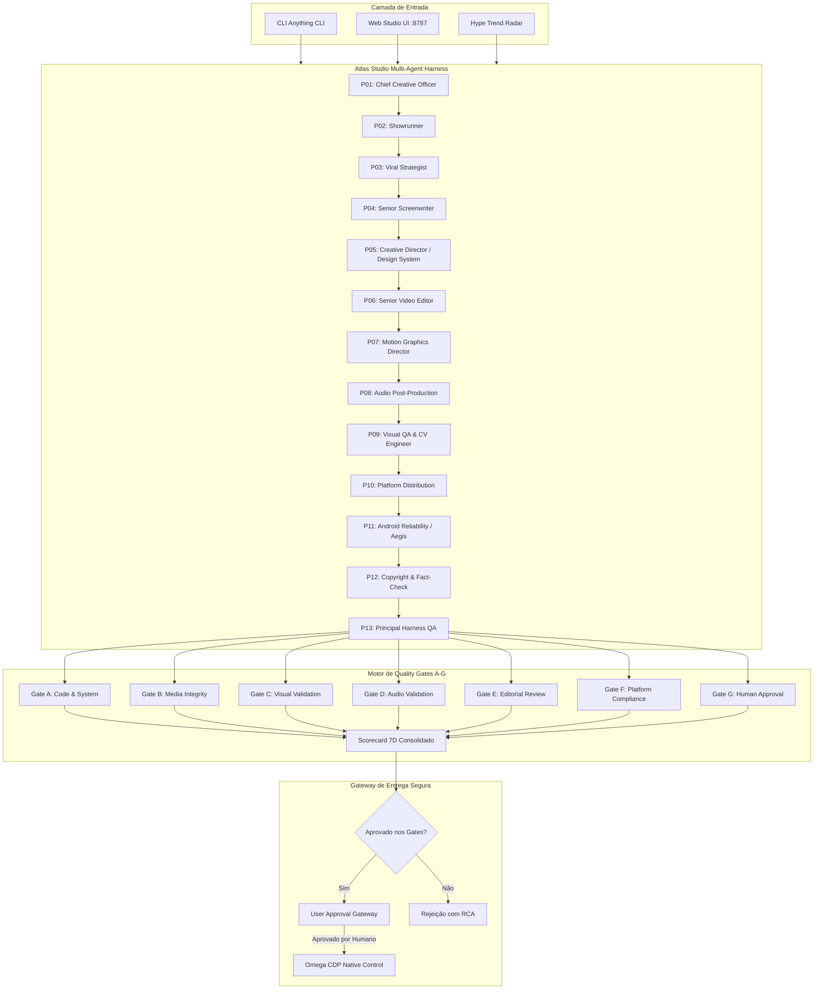

# DIAGRAMA DE COMPONENTES DO ATLAS STUDIO

```mermaid
graph TD
    subgraph Input_Layer [Camada de Entrada]
        CMD[CLI Anything CLI]
        WEB[Web Studio UI :8787]
        HYPE[Hype Trend Radar]
    end

    subgraph Logical_Harness [Atlas Studio Multi-Agent Harness]
        P1[P01: Chief Creative Officer] --> P2[P02: Showrunner]
        P2 --> P3[P03: Viral Strategist]
        P3 --> P4[P04: Senior Screenwriter]
        P4 --> P5[P05: Creative Director / Design System]
        P5 --> P6[P06: Senior Video Editor]
        P6 --> P7[P07: Motion Graphics Director]
        P7 --> P8[P08: Audio Post-Production]
        P8 --> P9[P09: Visual QA & CV Engineer]
        P9 --> P10[P10: Platform Distribution]
        P10 --> P11[P11: Android Reliability / Aegis]
        P11 --> P12[P12: Copyright & Fact-Check]
        P12 --> P13[P13: Principal Harness QA]
    end

    subgraph Quality_Gates_Engine [Motor de Quality Gates A-G]
        GA[Gate A: Code & System]
        GB[Gate B: Media Integrity]
        GC[Gate C: Visual Validation]
        GD[Gate D: Audio Validation]
        GE[Gate E: Editorial Review]
        GF[Gate F: Platform Compliance]
        GG[Gate G: Human Approval]
        
        P13 --> GA & GB & GC & GD & GE & GF & GG
        GA & GB & GC & GD & GE & GF & GG --> SCORE[Scorecard 7D Consolidado]
    end

    subgraph Delivery_Gateway [Gateway de Entrega Segura]
        SCORE --> AG{Aprovado nos Gates?}
        AG -- Sim --> UAG[User Approval Gateway]
        AG -- Não --> REJ[Rejeição com RCA]
        UAG -- Aprovado por Humano --> PUB[Omega CDP Native Control]
    end

    CMD --> Logical_Harness
    WEB --> Logical_Harness
    HYPE --> Logical_Harness
```
